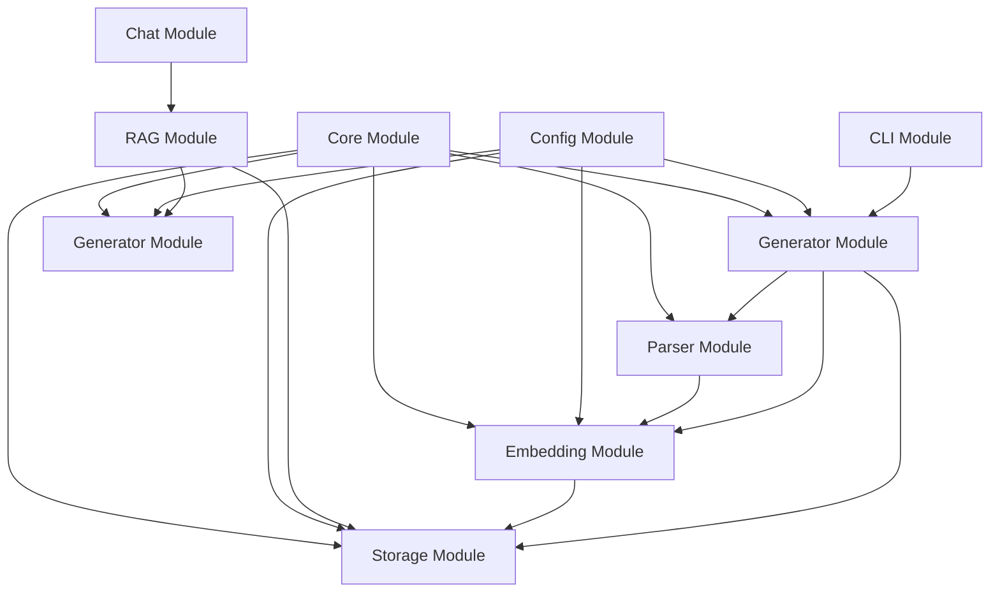
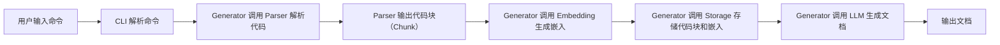
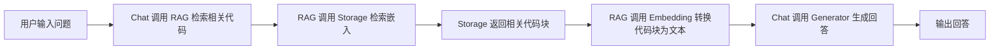
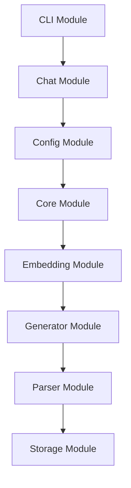

# 架构设计

# 架构设计

# CodeMind 架构设计文档

## 1. 架构概览
CodeMind 采用**分层架构**设计，通过模块化划分实现职责分离，核心模块包括 CLI（命令行接口）、Core（基础工具）、Config（配置管理）、Parser（代码解析）、Embedding（嵌入生成）、Storage（数据存储）、Generator（文档生成）和 Chat（对话交互）。各模块通过清晰的接口协作，支持代码解析、文档生成、对话问答等核心功能。

### 整体架构图

**说明**：  
- CLI 模块作为系统入口，接收用户命令并调用 Generator 模块执行核心任务。  
- Chat 模块通过 RAG（检索增强生成）模块整合 Storage 和 Generator，实现对话问答。  
- Config 模块为各模块提供统一配置，Core 模块提供日志、工具函数等基础支持。  
- Parser、Embedding、Storage 模块为 Generator 提供代码解析、嵌入生成和数据存储能力。  

## 2. 系统分层
CodeMind 的分层架构遵循**单一职责原则**，各层职责明确，交互清晰：

| 层级         | 职责描述                                                                 | 交互关系                                                                 |
|--------------|--------------------------------------------------------------------------|--------------------------------------------------------------------------|
| **CLI 层**    | 处理命令行输入，解析用户指令（如 `generate`、`chat`），调用对应模块执行任务。   | 作为系统入口，调用 Generator 或 Chat 模块。                                 |
| **Core 层**   | 提供基础工具（日志、常量、工具函数），供其他模块复用。                       | 被所有模块依赖，提供日志记录、路径处理等功能。                               |
| **Config 层** | 管理系统配置（如嵌入模型、存储后端、LLM 参数），支持动态加载和验证。           | 为 Generator、Embedding、Storage、Chat 模块提供配置。                       |
| **Parser 层** | 解析代码文件，提取符号（函数、类）、构建代码块（Chunk），生成结构化文档。       | 被 Generator 模块调用，输出解析后的代码结构。                               |
| **Embedding 层** | 将代码块转换为向量嵌入，支持语义检索。                                     | 被 Generator 和 Chat 模块调用，为 Storage 提供向量数据。                     |
| **Storage 层** | 存储代码块、嵌入向量和生成的文档，支持多种后端（如 Chroma、内存）。           | 被 Embedding、Generator、Chat 模块调用，提供数据持久化能力。                 |
| **Generator 层** | 核心业务层，整合 Parser、Embedding、Storage，生成文档或回答用户问题。         | 依赖 Parser（解析代码）、Embedding（生成嵌入）、Storage（存储数据），被 CLI/Chat 调用。 |
| **Chat 层**   | 处理对话交互，通过 RAG 模块检索相关代码，调用 Generator 生成回答。             | 依赖 Storage（检索数据）、Generator（生成回答），被 CLI 调用。               |

## 3. 核心组件
以下是各模块的关键类及其职责与协作关系：

### 3.1 CLI 模块
- **关键类**：`commands.py` 中的 `GenerateCommand`、`ChatCommand`  
- **职责**：实现命令行命令的逻辑，如 `codemind generate`、`codemind chat`。  
- **协作**：通过 `click` 库解析命令参数，调用 Generator 或 Chat 模块的对应方法。

### 3.2 Chat 模块
- **关键类**：`manager.py`（对话管理器）、`rag.py`（RAG 实现）  
- **职责**：管理对话状态，通过 RAG 模块检索相关代码，生成回答。  
- **协作**：`rag.py` 调用 Storage 模块的 `search` 方法检索嵌入，调用 Generator 模块的 `generate_answer` 方法生成回答。

### 3.3 Config 模块
- **关键类**：`manager.py`（配置管理器）、`schemas.py`（配置校验）  
- **职责**：加载配置文件（如 `config.yaml`），校验配置有效性，为其他模块提供配置实例。  
- **协作**：通过 `pydantic` 校验配置，支持动态更新配置（如切换嵌入模型）。

### 3.4 Core 模块
- **关键类**：`logger.py`（日志管理器）、`utils.py`（工具函数）  
- **职责**：提供日志记录（支持文件/控制台输出）、路径处理、字符串工具等基础功能。  
- **协作**：被所有模块依赖，确保日志格式统一、工具函数复用。

### 3.5 Embedding 模块
- **关键类**：`manager.py`（嵌入管理器）、`fastembed.py`（FastEmbed 实现）  
- **职责**：管理嵌入模型（如 FastEmbed），将文本转换为向量。  
- **协作**：`manager.py` 通过 Factory 模式创建不同的嵌入模型（如 FastEmbed、OpenAI Embedding），供 Parser 和 Generator 调用。

### 3.6 Generator 模块
- **关键类**：`llm_generator.py`（LLM 生成器）、`document_generator.py`（文档生成器）  
- **职责**：整合 Parser、Embedding、Storage，生成文档或回答。  
- **协作**：`document_generator.py` 调用 Parser 解析代码，调用 Embedding 生成嵌入，调用 Storage 存储数据；`llm_generator.py` 调用 LLM Agent 生成内容。

### 3.7 Parser 模块
- **关键类**：`tree_sitter_parser.py`（Tree-sitter 解析器）、`symbol_extractor.py`（符号提取器）  
- **职责**：使用 Tree-sitter 解析代码，提取符号（函数、类），构建代码块（Chunk）。  
- **协作**：`tree_sitter_parser.py` 支持多种语言（如 Python、Java），`symbol_extractor.py` 提取符号信息，供 Generator 生成文档。

### 3.8 Storage 模块
- **关键类**：`manager.py`（存储管理器）、`chroma.py`（Chroma 实现）  
- **职责**：管理数据存储（如 Chroma 向量数据库、内存存储），支持增删改查。  
- **协作**：`manager.py` 通过 Factory 模式创建不同的存储后端（如 Chroma、内存），供 Embedding、Generator、Chat 调用。

## 4. 数据流
### 4.1 文档生成流程（CLI -> Generator）

### 4.2 对话问答流程（Chat -> RAG -> Generator）

## 5. 设计决策
### 5.1 架构选择理由
1. **分层架构**：  
   通过分层实现职责分离，降低模块间耦合。例如，Parser 层专注于代码解析，不关心存储或生成逻辑，便于独立维护和扩展。  
2. **设计模式应用**：  
   - **Command 模式**：CLI 模块使用 Command 模式封装命令逻辑（如 `GenerateCommand`），便于添加新命令（如 `lint`）。  
   - **Factory 模式**：Embedding 和 Storage 模块通过 Factory 模式创建不同后端（如 FastEmbed、Chroma），支持动态切换。  
   - **Template Method 模式**：Generator 模块的 `llm_generator.py` 定义生成流程模板（解析→嵌入→存储→生成），子类可重写特定步骤（如自定义 LLM）。  
3. **模块化与可扩展性**：  
   每个模块独立，新增功能（如支持新语言、新存储后端）只需扩展对应模块，不影响其他模块。例如，添加 Rust 语言支持只需在 Parser 层新增 Rust 解析器。

### 5.2 潜在扩展点
1. **语言支持扩展**：  
   Parser 层可通过新增 `language_parser.py`（如 RustParser）支持更多语言，只需实现 `parse` 方法。  
2. **嵌入模型扩展**：  
   Embedding 层可通过新增 `openai_embed.py` 支持 OpenAI Embedding，只需在 `manager.py` 中添加工厂方法。  
3. **存储后端扩展**：  
   Storage 层可通过新增 `faiss.py` 支持 FAISS 向量数据库，只需实现 `base.py` 中的接口。  
4. **生成器扩展**：  
   Generator 层可通过新增 `markdown_generator.py` 支持 Markdown 文档生成，只需继承 `document_generator.py` 的模板方法。  
5. **对话模式扩展**：  
   Chat 层可通过新增 `rag_v2.py` 实现更复杂的 RAG 逻辑（如多轮对话、上下文管理）。

## 6. 总结
CodeMind 的架构设计通过分层、设计模式和模块化，实现了高内聚、低耦合的系统结构，支持代码解析、文档生成、对话问答等核心功能。未来可通过扩展语言、嵌入模型、存储后端等模块，满足更多场景需求。

## 系统架构图

