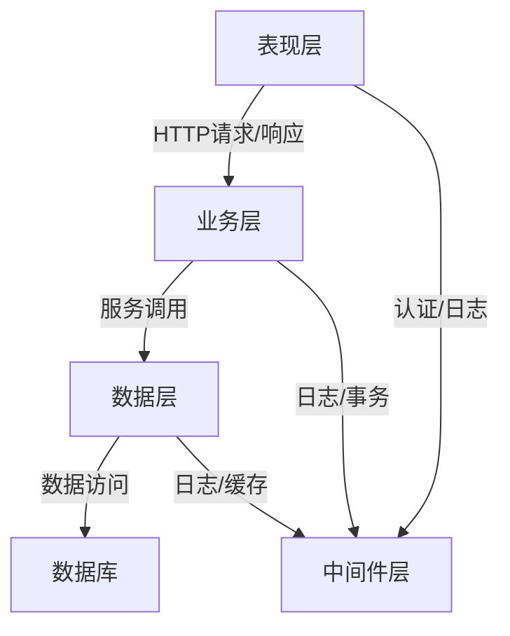
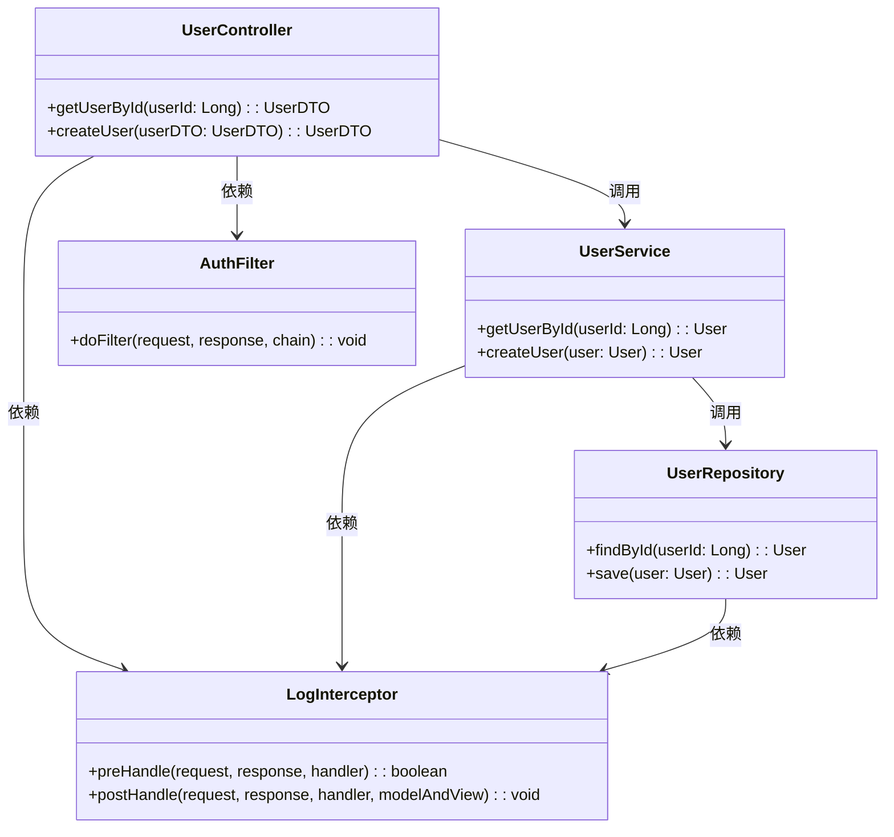
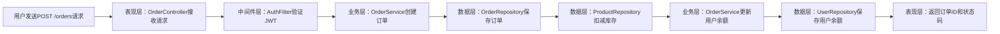

# 架构设计

# 架构设计

# 系统架构设计文档


## 1. 架构概览
本系统采用**分层架构（Layered Architecture）**，通过明确的层次划分实现关注点分离，提升系统的可维护性、可扩展性和可测试性。整体架构分为**表现层（Presentation Layer）**、**业务层（Business Layer）**、**数据层（Data Layer）**和**中间件层（Middleware Layer）**，各层之间通过定义良好的接口进行交互，避免直接依赖。



**架构说明**：  
- 表现层：负责处理用户请求（如REST API、Web界面），将请求转发至业务层，并返回响应结果。  
- 业务层：封装核心业务逻辑，协调各组件完成业务流程（如订单创建、用户认证）。  
- 数据层：负责数据持久化操作（如数据库读写、缓存访问），通过Repository模式隔离数据访问细节。  
- 中间件层：提供跨切面功能（如日志记录、认证授权、事务管理），被各层调用以增强系统稳定性。


## 2. 系统分层
### 2.1 表现层（Presentation Layer）
**职责**：  
- 接收外部请求（HTTP/HTTPS），解析请求参数，验证输入合法性。  
- 调用业务层服务，处理响应结果（如序列化JSON、渲染视图）。  
- 处理异常（如参数校验失败、业务逻辑异常），返回友好的错误信息。  

**交互**：  
- 通过RESTful API与客户端（Web/移动端）通信，使用Spring MVC或Express.js等框架实现。  
- 依赖中间件层进行认证（如JWT验证）和日志记录。  

### 2.2 业务层（Business Layer）
**职责**：  
- 实现核心业务逻辑（如订单处理、用户权限管理）。  
- 协调数据层和其他服务（如第三方支付接口）完成业务流程。  
- 处理事务（如订单创建时同时更新库存和用户余额）。  

**交互**：  
- 接收表现层的请求，调用数据层的Repository获取/存储数据。  
- 依赖中间件层进行事务管理和日志记录。  

### 2.3 数据层（Data Layer）
**职责**：  
- 提供数据访问接口（Repository），封装数据库操作（如CRUD）。  
- 支持多种数据源（如MySQL、MongoDB、Redis），通过适配器模式实现数据源切换。  
- 缓存数据（如Redis）以提升性能。  

**交互**：  
- 被业务层调用，执行具体的数据操作（如查询订单、保存用户信息）。  
- 依赖中间件层进行日志记录和缓存管理。  

### 2.4 中间件层（Middleware Layer）
**职责**：  
- 认证授权：验证用户身份（如JWT、OAuth2）。  
- 日志记录：记录请求/响应、异常信息，便于问题排查。  
- 事务管理：确保业务操作的一致性（如Spring Transaction）。  
- 缓存管理：管理Redis等缓存，减少数据库压力。  

**交互**：  
- 被表现层、业务层、数据层调用，提供跨切面功能。  


## 3. 核心组件
核心组件通过**类图**展示其职责和协作关系，主要包含表现层的Controller、业务层的Service、数据层的Repository，以及中间件层的AuthFilter、LogInterceptor等。



### 3.1 核心组件职责
- **UserController**：表现层控制器，处理用户相关的HTTP请求（如获取用户信息、创建用户）。  
- **UserService**：业务层服务，封装用户业务逻辑（如验证用户权限、生成用户ID）。  
- **UserRepository**：数据层Repository，负责用户数据的持久化（如查询、保存用户信息）。  
- **AuthFilter**：中间件层过滤器，实现JWT认证，拦截需要认证的请求。  
- **LogInterceptor**：中间件层拦截器，记录请求日志和响应时间。  

### 3.2 协作关系
- 表现层的`UserController`调用业务层的`UserService`处理业务逻辑。  
- 业务层的`UserService`调用数据层的`UserRepository`获取/存储数据。  
- 各层通过`AuthFilter`和`LogInterceptor`实现认证和日志功能，避免重复代码。  


## 4. 数据流
以**用户下单流程**为例，展示主要业务流程的数据流转：



### 数据流说明
1. **请求接收**：用户通过HTTP POST请求发送下单数据（如商品ID、数量）至表现层的`OrderController`。  
2. **认证验证**：中间件层的`AuthFilter`拦截请求，验证JWT token的有效性，确保用户已登录。  
3. **业务处理**：业务层的`OrderService`调用`OrderRepository`保存订单信息，同时调用`ProductRepository`扣减商品库存。  
4. **数据更新**：`OrderService`调用`UserRepository`更新用户余额（如扣除订单金额）。  
5. **响应返回**：表现层将订单ID和状态码（如200）返回给用户。  


## 5. 设计决策
### 5.1 架构选择理由
- **分层架构**：通过层次划分实现关注点分离，降低模块间耦合度。例如，表现层只需关注请求/响应，无需了解业务逻辑细节；业务层只需关注业务流程，无需关心数据存储方式。  
- **Repository模式**：数据层通过Repository接口隔离数据访问逻辑，便于更换数据源（如从MySQL切换至MongoDB）或添加缓存（如Redis）。  
- **中间件层**：将认证、日志、事务等跨切面功能集中管理，避免在各层重复实现，提升代码复用性。  

### 5.2 潜在扩展点
- **微服务拆分**：当前业务层可拆分为独立的微服务（如订单服务、用户服务），通过API Gateway通信，提升系统的可扩展性和容错性。  
- **缓存优化**：数据层可增加Redis缓存，缓存热点数据（如热门商品信息），减少数据库压力。  
- **多数据源支持**：通过适配器模式，数据层可支持多种数据库（如MySQL、PostgreSQL），满足不同业务场景的需求。  
- **异步处理**：对于耗时操作（如发送邮件、生成报表），可通过消息队列（如RabbitMQ、Kafka）实现异步处理，提升系统响应速度。  


## 6. 总结
本架构通过分层设计和核心组件的合理划分，实现了系统的可维护性、可扩展性和可测试性。未来可根据业务需求，通过微服务拆分、缓存优化等方式进一步提升系统性能和灵活性。

## 系统架构图

```mermaid
classDiagram
    class ContextAssembler{
    
```

## 依赖关系图

```mermaid
graph LR
```
