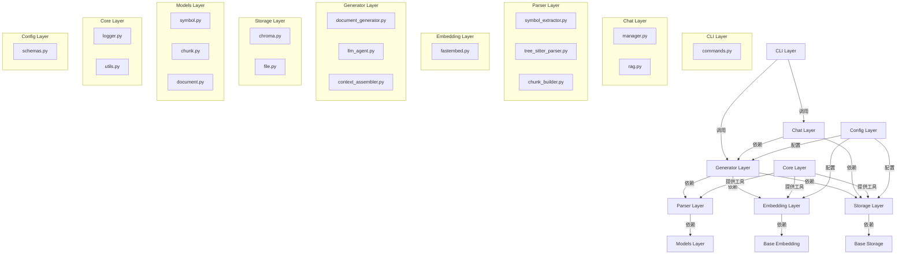
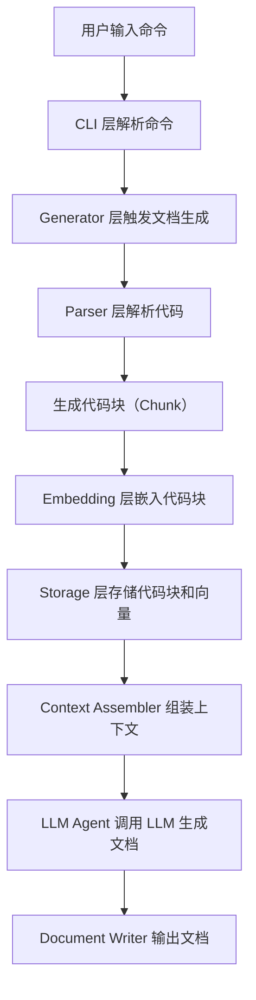

# 架构设计

# 架构设计

# CodeMind 架构设计文档

## 1. 架构概览
CodeMind 采用**分层架构**设计，通过清晰的模块划分实现代码解析、向量嵌入、文档生成和对话交互的核心功能。整体架构如下图所示：

## 2. 系统分层
CodeMind 的分层架构遵循**单一职责原则**，各层职责明确，层间通过接口或抽象类解耦，便于维护和扩展。

| 层级         | 职责                                                                 | 交互关系                                                                 |
|--------------|----------------------------------------------------------------------|--------------------------------------------------------------------------|
| **CLI 层**   | 命令行接口，处理用户输入（如 `codemind generate`、`codemind chat`），调用业务逻辑层。 | 调用 `Generator` 层生成文档，调用 `Chat` 层处理对话。                       |
| **Chat 层**  | 对话管理，实现检索增强生成（RAG）流程，支持代码相关的问答交互。             | 依赖 `Storage` 层检索向量数据，依赖 `Generator` 层生成响应。                 |
| **Parser 层**| 代码解析，提取符号（函数、类）、依赖关系，生成代码块（Chunk）。             | 依赖 `Models` 层存储解析结果，为 `Embedding` 层提供输入。                   |
| **Embedding 层**| 向量嵌入，将代码块转换为向量表示，支持语义检索。                         | 依赖 `BaseEmbedding` 抽象类，实现具体嵌入逻辑（如 `FastEmbed`）。             |
| **Generator 层**| 文档生成，组装上下文，调用 LLM 生成文档或代码注释。                       | 依赖 `Parser` 层的解析结果、`Embedding` 层的向量数据、`Storage` 层的存储。   |
| **Storage 层**| 数据存储，管理向量数据库（如 Chroma）或文件存储，持久化代码块和向量。       | 依赖 `BaseStorage` 抽象类，支持多种存储后端（如文件、Chroma）。              |
| **Models 层** | 数据模型，定义 `Symbol`、`Chunk`、`Document` 等核心数据结构。               | 被 `Parser` 层使用，作为解析结果的载体。                                   |
| **Core 层**   | 基础工具，提供日志、常量、工具函数（如文件扫描、MD5 缓存）。               | 被各层调用，支撑系统运行。                                               |
| **Config 层** | 配置管理，加载和验证系统配置（如 LLM 模型参数、存储路径）。               | 被 `Generator`、`Storage`、`Embedding` 层使用，统一配置管理。                |

## 3. 核心组件
以下是 CodeMind 的关键组件及其职责与协作关系：

### 3.1 CLI 层
- **`commands.py`**：实现命令行命令（如 `generate`、`chat`），通过 `Command` 模式封装业务逻辑，调用 `Generator` 或 `Chat` 层。
- **`__init__.py`**：初始化 CLI 应用，注册命令。

### 3.2 Chat 层
- **`manager.py`**：对话管理器，管理会话状态，协调 RAG 流程（检索→生成→响应）。
- **`rag.py`**：实现检索增强生成，调用 `Storage` 层检索相关代码块，调用 `Generator` 层生成回答。
- **`base.py`**：定义对话基类，支持扩展（如多轮对话、上下文管理）。

### 3.3 Parser 层
- **`symbol_extractor.py`**：符号提取器，使用 `TreeSitter` 解析代码，提取函数、类等符号。
- **`tree_sitter_parser.py`**：TreeSitter 解析器封装，支持多种编程语言（如 Python、Java）。
- **`chunk_builder.py`**：代码块构建器，将代码分割为语义块（Chunk），便于嵌入和检索。
- **`models/symbol.py`**：符号模型，存储函数、类的元数据（如名称、位置）。
- **`models/chunk.py`**：代码块模型，存储代码片段及其向量表示。

### 3.4 Embedding 层
- **`manager.py`**：嵌入管理器，使用 `Factory` 模式创建具体嵌入实现（如 `FastEmbed`），管理模型生命周期。
- **`fastembed.py`**：FastEmbed 实现，调用 Hugging Face 模型生成向量。
- **`base.py`**：嵌入基类，定义 `embed` 接口，支持扩展（如自定义嵌入模型）。

### 3.5 Generator 层
- **`document_generator.py`**：文档生成器，使用 `Template Method` 模式定义生成流程（解析→嵌入→存储→生成），子类可扩展（如生成 Mermaid 图）。
- **`llm_agent.py`**：LLM 代理，调用 LLM 模型生成文档或回答，封装请求逻辑。
- **`context_assembler.py`**：上下文组装器，从 `Storage` 层检索相关代码块，组装为 LLM 输入。
- **`document_writer.py`**：文档写入器，将生成的文档输出到文件（如 Markdown）。

### 3.6 Storage 层
- **`manager.py`**：存储管理器，使用 `Factory` 模式选择存储后端（如 `Chroma`、`File`），管理数据持久化。
- **`chroma.py`**：Chroma 实现，使用向量数据库存储代码块和向量。
- **`file.py`**：文件存储实现，将代码块存储为本地文件。
- **`base.py`**：存储基类，定义 `save`、`load`、`search` 接口，支持扩展。

### 3.7 Core 层
- **`logger.py`**：日志工具，统一系统日志输出。
- **`utils.py`**：工具函数，如文件扫描、MD5 缓存（`md5_cache.py`）。

### 3.8 Config 层
- **`manager.py`**：配置管理器，加载 `schemas.py` 定义的配置 schema，验证配置有效性。
- **`schemas.py`**：配置 schema，定义 LLM 参数、存储路径等配置结构。

## 4. 数据流
以下是 CodeMind 的主要业务流程（以“生成文档”为例）的数据流转：

## 5. 设计决策
### 5.1 分层架构
- **理由**：分层架构将系统划分为职责明确的模块，降低耦合度，便于独立开发、测试和维护。例如，`Parser` 层专注于代码解析，`Embedding` 层专注于向量生成，两者通过 `Chunk` 模型交互，无需直接依赖。
- **扩展点**：新增功能（如代码测试生成）可新增一层，或扩展现有层（如 `Generator` 层支持测试用例生成）。

### 5.2 设计模式应用
- **Command 模式（CLI 层）**：将命令（如 `generate`）封装为独立类，便于添加新命令（如 `lint`）而不修改现有逻辑。
- **Factory 模式（Embedding/Storage 层）**：通过工厂类创建具体实现（如 `FastEmbed`、`Chroma`），支持替换嵌入模型或存储后端（如从 Chroma 切换到 Elasticsearch）。
- **Template Method 模式（Generator 层）**：定义文档生成的通用流程（解析→嵌入→存储→生成），子类可重写特定步骤（如 `MermaidGenerator` 重写生成 Mermaid 图的逻辑）。

### 5.3 可扩展性设计
- **解析器扩展**：`Parser` 层的 `tree_sitter_parser.py` 支持 TreeSitter，可通过添加新的语言解析器（如 Go、JavaScript）扩展解析能力。
- **存储后端扩展**：`Storage` 层的 `base.py` 定义抽象接口，新增存储后端（如 Redis、MongoDB）只需实现接口即可。
- **LLM 模型扩展**：`Generator` 层的 `llm_agent.py` 封装 LLM 调用，支持切换 LLM 模型（如从 GPT-3.5 切换到 Claude）。

### 5.4 潜在扩展点
1. **多语言支持**：扩展 `Parser` 层，支持更多编程语言（如 Rust、Kotlin）。
2. **对话上下文管理**：增强 `Chat` 层，支持多轮对话和上下文记忆。
3. **增量更新**：实现代码变更的增量解析和嵌入，避免全量重新处理。
4. **可视化支持**：扩展 `Generator` 层，生成代码依赖图（如 Mermaid 图）或类图。

## 6. 总结
CodeMind 的架构设计通过分层、设计模式和可扩展性考虑，实现了代码解析、文档生成和对话交互的核心功能。各层职责明确，模块间解耦，便于后续功能扩展和维护。未来可通过扩展解析器、存储后端和 LLM 模型，进一步提升系统的适用性和性能。

## 系统架构图

```mermaid
flowchart TD
  node0[codemind]
  node1[__init__.py]
  node2[chat]
  node3[__init__.py]
  node4[base.py]
  node5[manager.py]
  node6[rag.py]
  node7[cli]
  node8[__init__.py]
  node9[commands.py]
  node10[config]
  node11[__init__.py]
  node12[manager.py]
  node13[schemas.py]
  node14[core]
  node15[__init__.py]
  node16[constants.py]
  node17[logger.py]
  node18[utils.py]
  node19[embedding]
  node20[__init__.py]
  node21[base.py]
  node22[fastembed.py]
  node23[manager.py]
  node24[generator]
  node25[__init__.py]
  node26[base.py]
  node27[context_assembler.py]
  node28[document_generator.py]
  node29[document_writer.py]
  node30[llm_agent.py]
  node31[llm_generator.py]
  node32[manager.py]
  node33[mermaid_generator.py]
  node34[main.py]
  node35[parser]
  node36[__init__.py]
  node37[chunk_builder.py]
  node38[dependency_analyzer.py]
  node39[file_scanner.py]
  node40[md5_cache.py]
  node41[models]
  node42[__init__.py]
  node43[chunk.py]
  node44[document.py]
  node45[symbol.py]
  node46[symbol_extractor.py]
  node47[tree_sitter_parser.py]
  node48[storage]
  node49[__init__.py]
  node50[base.py]
  node51[chroma.py]
  node52[file.py]
  node53[manager.py]
  node54[memory.py]
  node55[setup.py]
  node56[test_generator.py]
  node0 --> node1
  node0 --> node2
  node2 --> node3
  node2 --> node4
  node2 --> node5
  node2 --> node6
  node0 --> node7
  node7 --> node8
  node7 --> node9
  node0 --> node10
  node10 --> node11
  node10 --> node12
  node10 --> node13
  node0 --> node14
  node14 --> node15
  node14 --> node16
  node14 --> node17
  node14 --> node18
  node0 --> node19
  node19 --> node20
  node19 --> node21
  node19 --> node22
  node19 --> node23
  node0 --> node24
  node24 --> node25
  node24 --> node26
  node24 --> node27
  node24 --> node28
  node24 --> node29
  node24 --> node30
  node24 --> node31
  node24 --> node32
  node24 --> node33
  node0 --> node34
  node0 --> node35
  node35 --> node36
  node35 --> node37
  node35 --> node38
  node35 --> node39
  node35 --> node40
  node35 --> node41
  node41 --> node42
  node41 --> node43
  node41 --> node44
  node41 --> node45
  node35 --> node46
  node35 --> node47
  node0 --> node48
  node48 --> node49
  node48 --> node50
  node48 --> node51
  node48 --> node52
  node48 --> node53
  node48 --> node54
```

