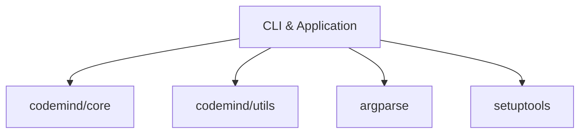

# 模块: CLI & Application

# CLI & Application

# CLI & Application 模块文档

## 1. 模块概述

### 职责
CLI & Application 模块负责提供命令行界面（CLI）和应用程序入口点，是用户与系统交互的主要接口层。

### 定位
作为应用程序的顶层模块，该模块：
- 提供命令行工具接口
- 管理应用程序启动流程
- 处理用户输入和输出
- 配置应用程序环境

### 设计意图
设计该模块的目的是将应用程序的启动逻辑、用户交互和配置管理集中在一个统一的入口点，使系统易于使用和维护。

## 2. 包含文件

| 文件路径 | 作用描述 |
|---------|---------|
| `codemind/cli/__init__.py` | CLI包的初始化文件，定义包级别导入 |
| `codemind/cli/commands.py` | 定义CLI命令和参数解析逻辑 |
| `codemind/main.py` | 应用程序主入口点，协调各组件启动 |
| `setup.py` | Python包配置文件，定义包元数据和依赖 |
| `test_generator.py` | 测试生成工具，用于自动生成测试用例 |

## 3. 核心功能

- **命令行界面**：提供用户友好的命令行交互方式
- **应用程序启动**：初始化并启动应用程序核心功能
- **参数解析**：解析命令行参数和选项
- **测试生成**：自动生成测试用例的实用工具
- **包配置管理**：管理应用程序的安装和配置

## 4. 关键组件

### 主要类和函数

#### CLI 命令类
- `commands.py` 中的命令类（具体名称需根据实际代码确定）
  - 负责处理特定CLI命令的逻辑
  - 解析命令参数
  - 执行相应操作

#### 应用程序入口函数
- `main.py` 中的 `main()` 函数
  - 应用程序启动入口点
  - 初始化应用程序环境
  - 协调各模块工作

#### 测试生成器
- `test_generator.py` 中的测试生成函数
  - 自动生成测试用例
  - 支持多种测试框架

## 5. 使用方法

### 基本使用

```bash
# 安装应用程序
pip install .

# 运行CLI命令
codemind [command] [options]

# 生成测试
codemind generate-tests [options]
```

### 常用命令示例

```bash
# 启动应用程序
codemind run

# 显示帮助信息
codemind --help

# 生成测试用例
codemind generate-tests --output tests/
```

## 6. 依赖关系

### 内部依赖
- 依赖 `codemind/core` 模块：使用核心功能和服务
- 依赖 `codemind/utils` 模块：使用工具函数和辅助类

### 外部依赖
- `argparse`：命令行参数解析
- `click` 或 `argparse`：CLI框架（根据实际实现）
- `setuptools`：包安装和配置

### 依赖关系图



该模块作为应用程序的入口层，负责协调用户输入与系统核心功能的交互，确保应用程序能够正确启动和运行。
