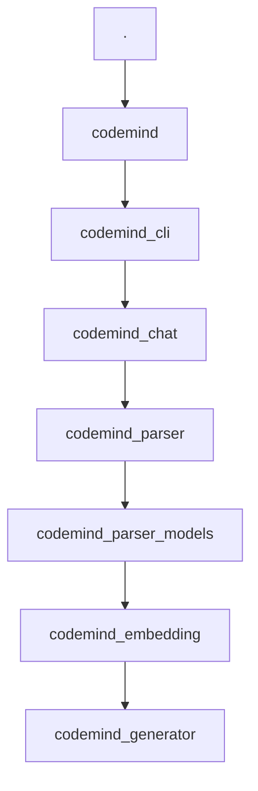

# 架构设计

# 架构设计

# Mock Response

This is a mock response generated in MOCK mode.

## Request Summary
- Model: glm-4.6v
- Provider: glm
- Prompt length: 2805 characters
- Temperature: 0.3
- Max Tokens: 4000

## Mock Content
This is a simulated response that would be generated by the LLM based on the provided prompt.
In real mode, the LLM would analyze the code context and generate comprehensive documentation.

### Key sections that would be generated:
- Detailed analysis of the codebase
- Structured documentation with clear sections
- Technical explanations and insights
- Usage examples and best practices

[MOCK RESPONSE END]

## 系统架构图

